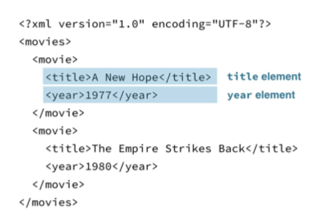

```{r, include=FALSE}
library(httr)
```


# Handling JSON and XML

## JSON

JSON (JavaScript Object Notation)

- http://www.json.org/
- Plain text format Two structures:
- objects: {"title" : "A New Hope", "year" : "1977"}
- arrays: [1977, 1980]
- Values: "string", 3, true, false, null, or another object or array

An example JSON data set

```
[
  {
    "title": "A New Hope",
    "year" : 1977 },
  {
    "title" : "The Empire Strikes Back",
    "year" : 1980 
  }
]
```

Indentifying a JSON response

```
> library(httr)
> url <- "http://httpbin.org/get" > r <- GET(url)
> http_type(r)
[1] "application/json"
```

Indentifying a JSON response

```
> writeLines(content(r, as = "text"))
No encoding supplied: defaulting to UTF-8.
{
  "args": {},
  "headers": {
    "Accept": "application/json, text/xml, application/xml, */*", 
    "Accept-Encoding": "gzip, deflate",
    "Connection": "close",
    "Host": "httpbin.org",
    "User-Agent": "libcurl/7.54.0 r-curl/2.8.1 httr/1.2.1" 
  },
  "origin": "98.232.182.170",
  "url": "http://httpbin.org/get" 
}
```

## Can you spot JSON? {.tabset .tabset-fade .tabset-pills}

### Questions

Here is some information on a couple of fictional Jasons stored in different formats. Which one is JSON?

A:

```
<jason>
  <person>
    <first_name>Jason</first_name>
    <last_name>Bourne</last_name>
    <occupation>Spy</occupation>
  </person>
  <person>
    <first_name>Jason</first_name>
    <last_name>Voorhees</last_name>
    <occupation>Mass murderer</occupation>
  </person>
</jason>
```

B:

```
first_name, last_name, occupation
Jason, Bourne, Spy
Jason, Voorhees, Mass murderer
```

C:

```
[{ 
   "first_name": "Jason",
   "last_name": "Bourne",
   "occupation": "Spy"
 },
{
  "first_name": "Jason",
  "last_name": "Voorhees",
  "occupation": "Mass murderer"
}]
```

### Answer

Possible Answers

[x] A     
[x] B       
[o] C      

## Parsing JSON {.tabset .tabset-fade .tabset-pills}

### Exercise

While JSON is a useful format for sharing data, your first step will often be to parse it into an R object, so you can manipulate it with R.

The content() function in `httr` retrieves the content from a request. It takes an `as` argument that specifies the type of output to return. You've already seen that `as = "text"` will return the content as a character string which is useful for checking the content is as you expect.

If you don't specify `as`, the default `as = "parsed"` is used. In this case the type of `content()` will be guessed based on the header and `content()` will choose an appropriate parsing function. For JSON this function is fromJSON() from the jsonlite package. If you know your response is JSON, you may want to use `fromJSON()` directly.

To practice, you'll retrieve some revision history from the Wikipedia API, check it is JSON, then parse it into a list two ways.

### Instructions

- Get the revision history for the Wikipedia article for `"Hadley Wickham"`, by calling `rev_history("Hadley Wickham")` (a function we have written for you), store it in `resp_json`.
- Check the `http_type()` of `resp_json`, to confirm the API returned a JSON object.
- You can't always trust a header, so check the content looks like JSON by calling `content()` on `resp_json` with an additional argument, `as = "text"`.
- Parse `resp_json` using `content()` by explicitly setting `as = "parsed"`.
- Parse the returned text (from step 3) with `fromJSON()` .

### script.R

```{r, collapse=TRUE}

# url <- "https://en.wikipedia.org/w/api.php?action=query&titles=Hadley%20Wickham&prop=revisions&rvprop=timestamp%7Cuser%7Ccomment%7Ccontent&rvlimit=5&format=json&rvdir=newer&rvstart=2015-01-14T17%3A12%3A45Z&rvsection=0"
# resp_json <- GET(url)
# saveRDS(resp_json, "data/had_rev_json.rds")

rev_history <- function(title, format = "json"){
  if (title != "Hadley Wickham") {
    stop('rev_history() only works for `title = "Hadley Wickham"`')
  }
  if (format == "json"){
    resp <- readRDS("data//had_rev_json.rds")
  } else if (format == "xml"){
    resp <- readRDS("data/had_rev_xml.rds")
  } else {
    stop('Invalid format supplied, try "json" or "xml"')
  }
  resp  
}

# Get revision history for "Hadley Wickham"
resp_json <- rev_history("Hadley Wickham")

# Check http_type() of resp_json
http_type(resp_json)

# Examine returned text with content()
content(resp_json, as = "text")

# Parse response with content()
content(resp_json, as = "parsed")

# Parse returned text with fromJSON()
library(jsonlite)
fromJSON(content(resp_json, as = "text"))
```

## Manipulating JSON

Movies example

```{r, collapse=TRUE}
library(jsonlite)

# Create a simple json format example
movies_json <- '
[
  {
    "title" : "A New Hope", 
    "year" : 1977
  },
  {
    "title" : "The Empire Strikes Back",
    "year" : 1980
  }
]'

fromJSON(movies_json, simplifyVector = FALSE)

```

Simplifying the output (I)

simplifyVector = TRUE (arrays of primitives become vectors)

```{r, collapse=TRUE}
fromJSON(movies_json, simplifyVector = TRUE)
```

Simplifying the output (II)

simplifyDataFrame = TRUE (arrays of objects become data frames)

```{r, collapse=TRUE}
fromJSON(movies_json, simplifyDataFrame = TRUE)
```

Extracting data from JSON (I)

```{r, collapse=TRUE}
fromJSON(movies_json, simplifyDataFrame = TRUE)$title
```

Extracting data from JSON (II)

Iterate over list

- rlist
- base
- tidyverse

## Manipulating parsed JSON{.tabset .tabset-fade .tabset-pills}

### Exercise

As you saw in the video, the output from parsing JSON is a list. One way to extract relevant data from that list is to use a package specifically designed for manipulating lists, `rlist`.

`rlist` provides two particularly useful functions for selecting and combining elements from a list: list.select() and list.stack(). `list.select()` extracts sub-elements by name from each element in a list. For example using the parsed movies data from the video (`movies_list`), we might ask for the `title` and `year` elements from each element:

`list.select(movies_list, title, year)`

The result is still a list, that is where list.stack() comes in. It will stack the elements of a list into a data frame.

```
list.stack(
    list.select(movies_list, title, year)
)
```

In this exercise you'll use these `rlist` functions to create a data frame with the user and timestamp for each revision.


### Instrucitons

- First, you'll need to figure out where the revisions are. 
- Examine the output from the str() call. Can you see where the list of 5 revisions is?
- Store the revisions in revs.
- Use list.select() to pull out the user and timestamp elements from each revision, store in user_time.
- Print user_time to verify it's a list with one element for each revision.
- Use list.stack() to stack the lists into a data frame.

### script.R

```{r, collapse=TRUE}
# Load rlist
library(rlist)

resp_json <- readRDS("data/had_rev_json.rds")

# Examine output of this code
str(content(resp_json), max.level = 4)

# Store revision list
revs <- content(resp_json)$query$pages$`41916270`$revisions

# Extract the user element
user_time <- list.select(revs, user, timestamp)

# Print user_time
user_time

# Stack to turn into a data frame
list.stack(user_time)
```

## Reformatting  {.tabset .tabset-fade .tabset-pills}

### Exercise

Of course you don't have to use `rlist`. You can achieve the same thing by using functions from base R or the tidyverse. In this exercise you'll repeat the task of extracting the username and timestamp using the `dplyr` package which is part of the tidyverse.

Conceptually, you'll take the list of revisions, stack them into a data frame, then pull out the relevant columns.

`dplyr`'s `bind_rows()` function takes a list and turns it into a data frame. Then you can use `select()` to extract the relevant columns. And of course if we can make use of the `%>%` (pipe) operator to chain them all together.

Try it!

### Instructions

- Pipe the list of revisions into `bind_rows()`.
- Use `select()` to extract the `user` and `timestamp` columns.

### script.R

```{r, collapse=TRUE}
# Load dplyr
library(dplyr)

# Pull out revision list
revs <- content(resp_json)$query$pages$`41916270`$revisions

# Extract user and timestamp
revs %>%
  bind_rows %>%           
  select(user, timestamp)
```

## XML structure

Movies in XML

```
<?xml version="1.0" encoding="UTF-8"?> <movies>
<movie>
<title>A New Hope</title> <year>1977</year>
</movie> <movie>
<title>The Empire Strikes Back</title>
<year>1980</year> </movie>
</movies>
```

- Tags: `<tagname>... </tagname>.`
- E.g. `<movies>, <movie>, <title>, <year>`

Tags can have attributes

```
<?xml version="1.0" encoding="UTF-8"?> <movies>
<movie>
<title year = "1977">A New Hope</title>
</movie> <movie>
<title year = "1980">The Empire Strikes Back</title> </movie>
</movies>
```

The hierarchy of XML elements

```{r, out.width="75%", echo=FALSE}



```

Understanding XML as a tree

```{r, out.width="75%", echo=FALSE}


```

## Do you understand XML structure? {.tabset .tabset-fade .tabset-pills}

### Questions

Take a look at this XML document:

```
<jason>
  <person type = "fictional">
    <first_name>
      Jason
    </first_name>
    <last_name>
      Bourne
    </last_name>
    <occupation>
      Spy
    </occupation>
  </person>
</jason>
```

Which of the following is false?

### Answer

Possible Answers

[o] The contents of the first_name element is the text Jason.
[o] The type attribute of the person element is "fictional".
[o] The person element is a child of the jason element.
[x] The last_name element is a child of the first_name element.

## Examining XML documents {.tabset .tabset-fade .tabset-pills}

### Exercise

Just like JSON, you should first verify the response is indeed XML with http_type() and by examining the result of content(r, as = "text"). Then you can turn the response into an XML document object with read_xml().

One benefit of using the XML document object is the available functions that help you explore and manipulate the document. For example xml_structure() will print a representation of the XML document that emphasizes the hierarchical structure by displaying the elements without the data.

In this exercise you'll grab the same revision history you've been working with as XML, and take a look at it with xml_structure().

### Instructions

- Get the XML version of the revision history for the Wikipedia article for "Hadley Wickham", by calling rev_history("Hadley Wickham", format = "xml"), store it in resp_xml.
- Check the response type of resp_xml to confirm the API returned an XML object.
- You can't always trust a header, so check the content looks like XML by calling content() on resp_xml with as = "text", store in rev_text.
- Turn rev_text into an XML object with read_xml() from the xml2 package, store as rev_xml.
- Call xml_structure() on rev_xml to see the structure of the returned XML. Can you see where the revisions are?

### script.R

```{r, collapse=TRUE}
# xml_url <- "https://en.wikipedia.org/w/api.php?action=query&titles=Hadley%20Wickham&prop=revisions&rvprop=timestamp%7Cuser%7Ccomment%7Ccontent&rvlimit=5&format=xml&rvdir=newer&rvstart=2015-01-14T17%3A12%3A45Z&rvsection=0"
# resp_xml <- GET(xml_url)
# saveRDS(resp_xml, "data/had_rev_xml.rds")

# Load xml2
library(xml2)

# Get XML revision history
resp_xml <- rev_history("Hadley Wickham", format = "xml")

# Check response is XML 
http_type(resp_xml)

# Examine returned text with content()
rev_text <- content(resp_xml, as = "text")
rev_text

# Turn rev_text into an XML document
rev_xml <- read_xml(rev_text)

# Examine the structure of rev_xml
xml_structure(rev_xml)
```

## XPATHs

__Movies example__

```{r}
library(xml2)

movies_xml <- read_xml(
'<?xml version="1.0" encoding="UTF-8"?> 
  <movies>
    <title>"Star Wars"</title> 
    <movie episode = "IV">
      <title>A New Hope</title>
      <year>1977</year> 
    </movie>
    <movie episode = "V">
      <title>The Empire Strikes Back</title>
      <year>1980</year> 
    </movie>
  </movies>'
  )
```

__XPATHS__

- Specify locations of nodes, a bit like file paths: /movies/movie/title 
- xml_find_all(x = \_\_\_\_, xpath = \_\_\_)

```{r, collapse=TRUE}
xml_find_all(movies_xml, xpath = "/movies/movie/title")

# Store the title nodeset
title_nodes <- xml_find_all(movies_xml, xpath = "/movies/movie/title")

# Extract contents with xml_text()
xml_text(title_nodes)

```

__Other XPATH Syntax__

- // - a node at any level below
- //title

```{r, collapse=TRUE}
xml_find_all(movies_xml, "//title")
```

- @ - to extract attributes
- //movie/\@episode

```{r, collapse=TRUE}
xml_find_all(movies_xml, "//movie/@episode")
```

__or ..__

- xml_attr()
- xml_attrs()

__Wrap Up__

| XPATH | Meaning |
|-------|---------|
| /node | Elements with tag node at this level |
| //node | Elements with tag node anywhere at or below this level |
| \@attr | Attribute with name attr |

- Get nodes with xml_find_all()
- Extract contents with xml_double(), xml_integer() or as_list()
 
## Extracting XML data {.tabset .tabset-fade .tabset-pills}

### Exercise

XPATHs are designed to specifying nodes in an XML document. Remember `/node_name` specifies nodes at the current level that have the tag `node_name`, where as `//node_name` specifies nodes at any level below the current level that have the tag node_name.

`xml2` provides the function `xml_find_all()` to extract nodes that match a given XPATH. For example, `xml_find_all(rev_xml, "/api")` will find all the nodes at the top level of the `rev_xml` document that have the tag api. Try running that in the console. You'll get a nodeset of one node because there is only one node that satisfies that XPATH.

The object returned from `xml_find_all()` is a nodeset (think of it like a list of nodes). To actually get data out of the nodes in the nodeset, you'll have to explicitly ask for it with `xml_text()` (or `xml_double()` or `xml_integer()`).

Use what you know about the location of the revisions data in the returned XML document extract just the content of the revision.

### Instructions

- Use `xml_find_all()` on `rev_xml` to find all the nodes that describe revisions by using the XPATH, `"/api/query/pages/page/revisions/rev"`.
- Use `xml_find_all()` on `rev_xml` to find all the nodes that are in a `rev` node anywhere in the document, store in `rev_nodes`.
- Extract the contents from each node in `rev_nodes`, by passing `rev_nodes` to `xml_text()`.

### script.R

```{r, collapse=TRUE}
rev_xml <- read_xml(content(resp_xml, "text"))

# Find all nodes using XPATH "/api/query/pages/page/revisions/rev"
xml_find_all(rev_xml, "/api/query/pages/page/revisions/rev")

# Find all rev nodes anywhere in document
rev_nodes <- xml_find_all(rev_xml, "//rev")

# Use xml_text() to get text from rev_nodes
xml_text(rev_nodes)
```

## Extracting XML attributes {.tabset .tabset-fade .tabset-pills}

### Exercise

Not all the useful data will be in the content of a node, some might also be in the attributes of a node. To extract attributes from a nodeset, `xml2` provides `xml_attrs()` and `xml_attr()`.

`xml_attrs()` takes a nodeset and returns all of the attributes for every node in the nodeset. `xml_attr()` takes a nodeset and an additional argument `attr` to extract a single named argument from each node in the nodeset.

In this exercise you'll grab the `user` and `anon` attributes for each revision. You'll see `xml_find_first()` in the sample code. It works just like `xml_find_all()` but it only extracts the first node it finds.

### Instructions

We've extracted `rev_nodes` and `first_rev_node` in the document for you to explore the difference between `xml_attrs()` and `xml_attr()`.

- Use `xml_attrs()` on `first_rev_node` to see all the attributes of the first revision node.
- Now use xml_attr() again, but this time on rev_nodes to extract the user attribute from all revision nodes.
- Use `xml_attr()` on `first_rev_node` along with an appropriate `attr` argument to extract the user attribute from the first revision node.
- Use `xml_attr()` on `rev_nodes` to extract the `anon` attribute from all revision nodes.

### script.R

```{r, collapse=TRUE}
# All rev nodes
rev_nodes <- xml_find_all(rev_xml, "//rev")

# The first rev node
first_rev_node <- xml_find_first(rev_xml, "//rev")

# Find all attributes with xml_attrs()
xml_attrs(first_rev_node)

# Find user attribute with xml_attr()
xml_attr(first_rev_node, "user")

# Find user attribute for all rev nodes
xml_attr(rev_nodes, "user")

# Find anon attribute for all rev nodes
xml_attr(rev_nodes, "anon")
```

## Wrapup: returning nice API output {.tabset .tabset-fade .tabset-pills}

### Exercise

How might all this work together? A useful API function will retrieve results from an API and return them in a useful form. In Chapter 2, you finished up by writing a function that retrieves data from an API that relied on `content()` to convert it to a useful form. To write a more robust API function you shouldn't rely on `content()` but instead parse the data yourself.

To finish up this chapter you'll do exactly that: write `get_revision_history()` which retrieves the XML data for the revision history of page on Wikipedia, parses it, and returns it in a nice data frame.

So that you can focus on the parts of the function that parse the return object, you'll see your function calls `rev_history()` to get the response from the API. You can assume this function returns the raw response and follows the best practices you learnt in Chapter 2, like using a user agent, and checking the response status.

### Instructions

Fill in the `___` to finish the function definition.

- Use `read_xml()` to turn the `content()` of `rev_resp` as text into an XML object.
- Use `xml_find_all()` to find all the `rev` nodes in the XML.
- Parse out the `"user"` attribute from `rev_nodes`.
- Parse out the content from `rev_nodes` using `xml_text()`.
- Finally, call `get_revision_history()` with `article_title = "Hadley Wickham"`.

### script.R

```{r, collapse=TRUE}
get_revision_history <- function(article_title){
  # Get raw revision response
  rev_resp <- rev_history(article_title, format = "xml")
  
  # Turn the content() of rev_resp into XML
  rev_xml <- read_xml(content(rev_resp, "text"))
  
  # Find revision nodes
  rev_nodes <- xml_find_all(rev_xml, "//rev")

  # Parse out usernames
  user <- xml_attr(rev_nodes, "user")
  
  # Parse out timestamps
  timestamp <- readr::parse_datetime(xml_attr(rev_nodes, "timestamp"))
  
  # Parse out content
  content <- xml_text(rev_nodes)
  
  # Return data frame 
  data.frame(user = user,
    timestamp = timestamp,
    content = substr(content, 1, 40))
}

# Call function for "Hadley Wickham"
get_revision_history("Hadley Wickham")
```
